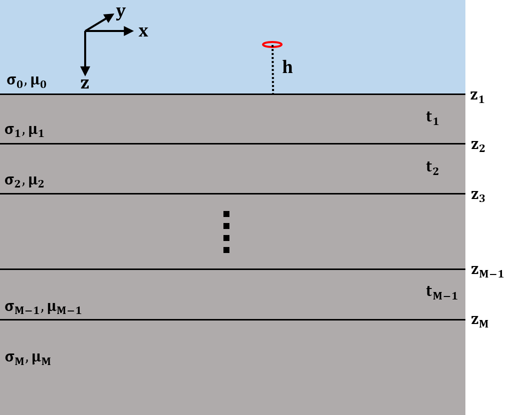

.. _overview:

EM1DTM package overview
=======================

Description
-----------

EM1DTM is a Fortran-based, multi-platform program library for carrying out the
one-dimensional inversion of time-domain, small loop, electromagnetic
data acquired to determine the spatial variation of the electrical
conductivity and/or magnetic susceptibility of the subsurface. The name
"EM1DTM" derives from: electromagnetics ("EM"), one-dimensional models ("1D"),
time-domain observations ("T"), and magnetic (dipole) sources and
receivers ("M").

The acquired data are measurements of the magnetic field due to electric
currents induced in the subsurface by a time-varying current in a transmitter
loop. Information about how the conductivity vary with depth is obtained by
making measurements for different times of the transmitter current, and for
different separations, heights and orientations of the receivers. Different
soundings provide information about the lateral variation in the subsurface. A
sounding is a distinct collection of TEM measurements (transmitters, receivers
and times) which are used to recover a corresponding 1D layered Earth model.
On the figure below, we see the use of separate soundings to map lateral
variation.

     Layered 1D model describing the Earth for each sounding.

For any sounding location, the mathematical representation that EM1DTM uses to
model the Earth varies only with depth. In particular, the representation
comprises many uniform "infinite" horizontal layers. For a complete mathematical
treatment of the forward and inversion problem, see :ref:`Background
Theory<theory>`.

The initial research underlying this program library was funded principally by
the “IMAGE” consortium, of which the following companies were participants:
AGIP, Anglo American, Billiton, Cominco, Falconbridge, INCO, MIM, Muskox
Minerals, Newmont, Placer Dome and Rio Tinto, and from the Natural Sciences
and Engineering Research Council of Canada (NSERC).

Program library content
-----------------------

This package consists of two programs:

   - **EM1DTM:** carries out the inversion of small loop, time-domain EM data assuming a layered Earth model

   - **EM1DTMFWD:** a stand-alone program for forward modeling the time-domain response assuming a layered Earth model

Licensing
---------

A **constrained educational version** of the program is available with
the `IAG <http://www.flintbox.com/public/project/1605/>`__ package
(please visit `UBC-GIF website <http://gif.eos.ubc.ca>`__ for details).
The educational version is fully functional so that users can learn how
to carry out effective and efficient 3D inversions of magnetic data.
**However, RESEARCH OR COMMERCIAL USE IS NOT POSSIBLE because the
educational version only allows a limited number of data and model
cells**.

Licensing for an unconstrained academic version is available - see the
`Licensing policy document <http://gif.eos.ubc.ca/software/licenses>`__.

**NOTE:** All academic licenses will be **time-limited to one year**.
You can re-apply after that time. This ensures that everyone is using
the most recent versions of codes.

Licensing for commercial use is managed by third party distributors.
Details are in the `Licensing policy document <http://gif.eos.ubc.ca/software/licenses>`__.

Installing
----------

There is no automatic installer currently available for the . Please
follow the following steps in order to use the software:

#. Extract all files provided from the given zip-based archive and place
   them all together in a new folder such as

#. Add this directory as new path to your environment variables.

Two additional notes about installation:

-  Do not store anything in the "bin" directory other than executable
   applications and Graphical User Interface applications (GUIs).

-  A Message Pass Interface (MPI) version is available for Linux upon
   and the installation instructions will accompany the code.

