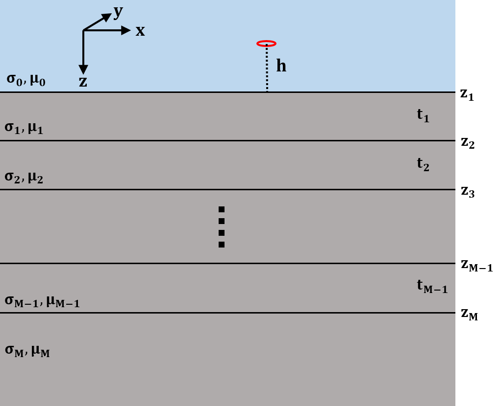
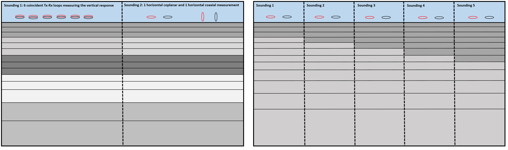

.. _theory:

Background theory
=================

Introduction
------------

The EM1DTM and EM1DTMFWD programs are designed to interpret time-domain, small loop, electromagnetic data over a 1D layered Earth.
These programs model the Earth's time-domain electromagnetic response due to a small inductive loop source which carries a sinusoidal time-varying current.
The data are the secondary magnetic field which results from currents and magnetization induced in the Earth.

.. _theory_source:

Details regarding the source and receiver
^^^^^^^^^^^^^^^^^^^^^^^^^^^^^^^^^^^^^^^^^

EM1DTM and EM1DTMFWD assume that the transmitter loop is horizontal. The
programs also assume that each receiver loop is sufficiently small and that
they may be considered point receivers; i.e. the spatial variation in magnetic
flux through the receiver loop is negligible.

.. _theory_domain:

Details regarding the domain
^^^^^^^^^^^^^^^^^^^^^^^^^^^^

     Layered 1D model describing the Earth for each sounding.

EM1DTM and EM1DTMFWD model the Earth's response for measurements above a stack
of uniform, horizontal layers. **The coordinate system used for describing the
Earth models has z as positive downwards, with the surface of the Earth at
z=0**. The z-coordinates of the source and receiver locations (which must be
above the surface) are therefore negative. Each layer is defined by a
thickness and an electrical conductivity. It is the physical properties of the
layers that are obtained during the inversion of all measurements gathered at
a single location, with the depths to the layer interfaces remaining fixed. If
measurements made at multiple locations are being interpreted, the
corresponding one-dimensional models are juxtaposed to create a two-
dimensional image of the subsurface.

All measurements that are to be inverted for a single one- dimensional model
must be grouped together as a “sounding”. A sounding can be considered a
distinct collection of TEM measurements (receivers and times) for a given
transmitter. Each different sounding is inverted for a separate one-
dimensional model.

     Two distinct groupings of transmitters and receivers (soundings) at the same location (left). Different soundings used to map lateral variation in the Earth (right). **Click to enlarge**.

The electrical conductivity of Earth materials varies over several orders of magnitude, making it more
natural to invert for the logarithms of the layer conductivities rather than the conductivities themselves.
This also ensures that conductivities in the constructed model are positive.

.. _theory_data:

Details regarding the data
^^^^^^^^^^^^^^^^^^^^^^^^^^

For a horizontal loop source, EM1DTM and EM1DTMFWD can handle any combination of:

    - times for the transmitter current
    - separations and heights for the transmitter and receiver(s)
    - B-field or time varying (dBdt) response
    - x, y and z-components of the response

Programs EM1DTM and EM1DTMFWD accept observations in two different forms:
values of the secondary magnetic field H-field in A/m and values of the total H-field in A/m. If the
transmitter and receiver have the same orientation, the x-, y- and
z-components of the secondary field are normalized by the x-, y- and
z-components of the free-space field respectively. If the transmitter and
receiver have different orientations, the secondary field is normalized by the
magnitude of the free-space field.

.. _theory_fwd:

Forward Modeling
----------------

The method used to compute the magnetic field values for a particular source-receiver arrangement over a
layered Earth model is the matrix propagation approach described in Farquharson (:cite:`Farquharson2003`). The method
uses the z-component of the Schelkunoff F-potential (:cite:`Ward1987`):

This appendix covers the aspects of the forward-modelling procedure for the
three components of the magnetic field above a horizontally-layered Earth
model for a horizontal, many-sided transmitter loop also above the surface of
the model that are not covered in Appendix~A of the notes for program EM1DFM.
The field for the transmitter loop is computed by the superposition
of the fields due to horizontal electric dipoles (see eqs.~4.134--4.152
:cite:`Ward1987`). Because the loop is closed, the contributions from the ends
of the electric dipole are ignored, and the superposition is carried out only
over the **TE**-mode component. This TE-mode only involves the *z*-component
of the Schelkunoff :math:`\mathbf{F}`-potential, just as for program `EM1DFM <http://em1dfm.readthedocs.io/en/latest>`_. The
propagation of *F* through the stack of layers therefore happens in exactly
the same way, and so is not repeated here (`see EM1DFM Forward modeling section <http://em1dfm.readthedocs.io/en/latest/content/theory.html#forward-modeling>`_).

.. note::
    **Assumptions**
        - :math:`e^{i\omega t}` time-dependence (just as in :cite:`Ward1987`)
        - quasi-static approximation throughout
        - *z* positive downwards
        - air halfspace (:math:`\sigma=0`) for *z<0*, piecewise constant model (:math:`\sigma>0`) of *N* layers for *z\ge0*, :math:`N^{th}` layer being the basement (i.e.~homogeneous) halfspace
        - magnetic permeability everywhere equal to that of free space.

From the propagation of *F* through the layers gives the following expression for the
kernel of the Hankel transform, :math:`\tilde{F}`, in the air halfspace (:math:`z<0`):

.. math::
    \tilde{F}_0\;=D_0^S\Big(e^{-u_0z}\;+\;{P_{21}\over P_{11}}e^{u_0z}\Big)
    :label: A-1

(same as `here in EM1DFM <http://em1dfm.readthedocs.io/en/latest/content/theory.html#equation-final-soln>`_).

For a horizontal :math:`x`-directed electric dipole at a height :math:`h`
(i.e., :math:`z=-h`, :math:`h>0`) above the surface of the layered Earth, the
downward-decaying part of the primary solution of :math:`\tilde{F}` (and the
only downward-decaying part of the solution in the air halfspace) at the
surface of the Earth (:math:`z=0`) is given by

.. math::
    D_0^S\;=\;-\,{i\omega\mu_0\over 2u_0}\>{ik_y\over k_x^2+k_y^2}\>e^{-u_0h}
    :label: A-2

from :cite:`Ward1987`, equation (4.137).
Substituting :eq:`A-2` into :eq:`A-1` gives

.. math::
    \tilde{F}_0\;=-\,{i\omega\mu_0\over 2u_0}\>{ik_y\over k_x^2+k_y^2}\>
    \Big(e^{-u_0(z+h)}\;+\;{P_{21}\over P_{11}}e^{u_0(z-h)}\Big).
    :label: A-3

Generalizing this expression for :math:`z` above (:math:`z<-h`) as well as
below the source (:math:`z>-h`):

.. math::
    \tilde{F}_0\;=-\,{i\omega\mu_0\over 2u_0}\>{ik_y\over k_x^2+k_y^2}\>
    \Big(e^{-u_0|z+h|}\;+\;{P_{21}\over P_{11}}e^{u_0(z-h)}\Big).
    :label: A-4

Applying the inverse Fourier transform to :eq:`A-4` gives

.. math::
    F_0(x,y,z,\omega)\;=\;-\,{1\over4\pi^2}\int_{-\infty}^{\infty}\int_{-\infty}^{\infty}
    {i\omega\mu_0\over 2u_0}\>{ik_y\over k_x^2+k_y^2}\>
    \Big(e^{-u_0|z+h|}\;+\;{P_{21}\over P_{11}}e^{u_0(z-h)}\Big)\,
    e^{i(k_xx+k_yy)}\;dk_x\,dk_y
    :label: A-5

(equation (4.139) of :cite:`Ward1987`).
Using the identity

.. math::
    \int_{\infty}^{\infty}\int_{\infty}^{\infty}\tilde{F}(k_x^2+k_y^2)\,dk_x\,dk_y\;=\;
    2\pi\int_0^{\infty}\tilde{F}(\lambda)\,\lambda\,J_0(\lambda r)\,d\lambda,
    :label: A-6

(:cite:`Ward1987`, equation (2.10)) where :math:`\lambda^2=k_x^2+k_y^2` and
:math:`r^2=x^2+y^2`, :eq:`A-5` can be rewritten as

.. math::
    F_0(x,y,z,\omega)\;=\;-\,{1\over2\pi}\,{\partial\over\partial y}\,\int_0^{\infty}
    {i\omega\mu_0\over 2u_0}\>{1\over\lambda^2}\>
    \Big(e^{-u_0|z+h|}\;+\;{P_{21}\over P_{11}}e^{u_0(z-h)}\Big)\,
    \lambda\,J_0(\lambda r)\,d\lambda,
    :label: A-7

.. math::
    =\;-\,{i\omega\mu_0\over4\pi}\,{\partial\over\partial y}\,\int_0^{\infty}
    \,\Big(e^{-\lambda|z+h|}\;+\;{P_{21}\over P_{11}}e^{\lambda(z-h)}\Big)\,
    {1\over\lambda^2}\,J_0(\lambda r)\,d\lambda,
    :label: A-8

.. math::
    =\;{i\omega\mu_0\over4\pi}\,{y\over r}\,\int_0^{\infty}
    \,\Big(e^{-\lambda|z+h|}\;+\;{P_{21}\over P_{11}}e^{\lambda(z-h)}\Big)\,
    {1\over\lambda}\,J_1(\lambda r)\,d\lambda
    :label: A-9

since

.. math::
    {\partial J_0(\lambda r)\over\partial y}\;=\;-\,\lambda{y\over r}\,J_1(\lambda r)
    :label: A-10

(:cite:`Ward1987`, equation 4.44 (almost)).

The :math:`H`-field in the air halfspace can be obtained from :eq:`A-9` (or :eq:`A-8`)
by using equation (1.130) of :cite:`Ward1987`:

.. math::
    H_x\;=\;{1\over i\omega\mu_0}\,{\partial^2F_0\over\partial x\partial z},
    :label: A-11

.. math::
    H_y\;=\;{1\over i\omega\mu_0}\,{\partial^2F_0\over\partial y\partial z},
    :label: A-12

.. math::
    H_z\;=\;{1\over i\omega\mu_0}\,\Big({\partial^2\over\partial z^2}\,+\,\kappa_0^2\Big)
    \,F_0
    :label: A-13

.. math::
    =\;{1\over i\omega\mu_0}\,{\partial^2F_0\over\partial z^2}.
    :label: A-14

since :math:`\kappa_0^2=0`.
Applying :eq:`A-11` to :eq:`A-9` gives

.. math::
    H_x(x,y,z,\omega)\;=\;{1\over4\pi}\,{\partial\over\partial x}\,{y\over r}\,\int_0^{\infty}
    \,\Big(\pm e^{-\lambda|z+h|}\;+\;{P_{21}\over P_{11}}e^{\lambda(z-h)}\Big)\,
    J_1(\lambda r)\,d\lambda.
    :label: A-15

(The plus/minus is to do with whether or not the observation location is above
or below the source. In the program, it perhaps it is only the secondary
fields that are computed using the above expressions: the primary field, which
corresponds to the first term in each Hankel transform kernel above is
computed using its for in :math:`(x,y,z)`-space.) When the above expression
for a horizontal electric dipole is integrated along a wire all that is left
is the effects of the endpoints. These will cancel when integrating around the
closed loop. So as far as the part of :math:`H_x` that contributes to the file
due to a closed loop:

.. math::
    H_x(x,y,z,\omega)\;=\;0.
    :label: A-16

For the :math:`y`-component of the H-field, first consider differentiating the
expression for :math:`F_0` in :eq:`A-5` with respect to :math:`y`:

.. math::
    {\partial F_0\over\partial y}\;=\;-\,{1\over4\pi^2}\,{\partial\over\partial y}\,
    \int_{-\infty}^{\infty}\int_{-\infty}^{\infty}
    {i\omega\mu_0\over 2u_0}\>{ik_y\over k_x^2+k_y^2}\>
    \Big(e^{-u_0|z+h|}\;+\;{P_{21}\over P_{11}}e^{u_0(z-h)}\Big)\,
    e^{i(k_xx+k_yy)}\;dk_x\,dk_y,
    :label: A-17

.. math::
    =\;{1\over4\pi^2}\,\int_{-\infty}^{\infty}\int_{-\infty}^{\infty}
    {i\omega\mu_0\over 2u_0}\>{k_y^2\over k_x^2+k_y^2}\>
    \Big(e^{-u_0|z+h|}\;+\;{P_{21}\over P_{11}}e^{u_0(z-h)}\Big)\,
    e^{i(k_xx+k_yy)}\;dk_x\,dk_y,
    :label: A-18

.. math::
    =\;{1\over4\pi^2}\,\int_{-\infty}^{\infty}\int_{-\infty}^{\infty}
    {i\omega\mu_0\over 2u_0}\>
    \Big(e^{-u_0|z+h|}\;+\;{P_{21}\over P_{11}}e^{u_0(z-h)}\Big)\,
    e^{i(k_xx+k_yy)}\;dk_x\,dk_y

.. math::
    \qquad-\;{1\over4\pi^2}\,\int_{-\infty}^{\infty}\int_{-\infty}^{\infty}
    {i\omega\mu_0\over 2u_0}\>{k_x^2\over k_x^2+k_y^2}\>
    \Big(e^{-u_0|z+h|}\;+\;{P_{21}\over P_{11}}e^{u_0(z-h)}\Big)\,
    e^{i(k_xx+k_yy)}\;dk_x\,dk_y,
    :label: A-19

since

.. math::
    {k_y^2\over k_x^2+k_y^2}\;=\;1\>-\>{k_x^2\over k_x^2+k_y^2}.
    :label: A-20

Converting the :math:`k_x^2` into derivatives with respect to :math:`x`, and converting the
two-dimensional Fourier transforms to Hankel transforms gives

.. math::
    {\partial F_0\over\partial y}\;=\;{i\omega\mu_0\over4\pi}\,\int_0^{\infty}
    \Big(e^{-\lambda|z+h|}\;+\;{P_{21}\over P_{11}}e^{\lambda(z-h)}\Big)\,
    J_0(\lambda r)\;d\lambda

.. math::
    \qquad\qquad+\;{i\omega\mu_0\over4\pi}\,{\partial^2\over\partial x^2}\,\int_0^{\infty}
    \Big(e^{-\lambda|z+h|}\;+\;{P_{21}\over P_{11}}e^{\lambda(z-h)}\Big)\,
    {1\over\lambda^2}\>J_0(\lambda r)\;d\lambda,
    :label: A-21

.. math::
    =\;{i\omega\mu_0\over4\pi}\,\int_0^{\infty}
    \Big(e^{-\lambda|z+h|}\;+\;{P_{21}\over P_{11}}e^{\lambda(z-h)}\Big)\,
    J_0(\lambda r)\;d\lambda

.. math::
    \qquad\qquad-\;{i\omega\mu_0\over4\pi}\,{\partial\over\partial x}\,{x\over r}\,\int_0^{\infty}
    \Big(e^{-\lambda|z+h|}\;+\;{P_{21}\over P_{11}}e^{\lambda(z-h)}\Big)\,
    {1\over\lambda}\>J_1(\lambda r)\;d\lambda,
    :label: A-22

using equations (4.144) and (4.117) of :cite:`Ward1987`. Differentiating :eq:`A-22`
with respect to :math:`z` and scaling by :math:`i\omega\mu_0` (see :eq:`A-12`)
gives

.. math::
    H_y(x,y,z,\omega)\;=\;{1\over4\pi}\,\int_0^{\infty}
    \Big(\pm e^{-\lambda|z+h|}\;+\;{P_{21}\over P_{11}}e^{\lambda(z-h)}\Big)\,
    \lambda\,J_0(\lambda r)\;d\lambda

.. math::
    \qquad\qquad-\;{1\over4\pi}\,{\partial\over\partial x}\,{x\over r}\,\int_0^{\infty}
    \Big(\pm e^{-\lambda|z+h|}\;+\;{P_{21}\over P_{11}}e^{\lambda(z-h)}\Big)\,
    J_1(\lambda r)\;d\lambda
    :label: A-23

(equation 4.150 of :cite:`Ward1987`).
The second integral in the above expression only contributes at the ends of the dipole.
So the only part of :math:`H_y` required to compute the field due to the closed loop is

.. math::
    H_y(x,y,z,\omega)\;=\;{1\over4\pi}\,\int_0^{\infty}
    \Big(\pm e^{-\lambda|z+h|}\;+\;{P_{21}\over P_{11}}e^{\lambda(z-h)}\Big)\,
    \lambda\,J_0(\lambda r)\;d\lambda.
    :label: A-24

Finally, applying :eq:`A-14` to :eq:`A-9` gives the :math:`z`-component of the H-field:

.. math::
    H_z(x,y,z,\omega)\;=\;{1\over4\pi}\,{y\over r}\,\int_0^{\infty}
    \,\Big(e^{-\lambda|z+h|}\;+\;{P_{21}\over P_{11}}e^{\lambda(z-h)}\Big)\,
    \lambda\,J_1(\lambda r)\,d\lambda
    :label: A-25

(equation (4.152) of :cite:`Ward1987`).

:eq:`A-24` and :eq:`A-25` are for the total H-field (:math:`H_x=0` from
:eq:`A-16` for an :math:`x`-directed electric dipole excluding the effects at
the end-points, that is, the wholespace field up in the air plus the field due
to currents induced in the layered Earth. In :eq:`A-24` and :eq:`A-25`, the
first part of the kernel of the Hankel transform corresponds to the primary
wholespace field:

.. math::
    H_y(x,y,z,\omega)\;=\;{1\over4\pi}\,\int_0^{\infty}
    \pm\,e^{-\lambda|z+h|}\,
    \lambda\,J_0(\lambda r)\;d\lambda,
    :label: A-26

.. math::
    =\;{1\over4\pi}\,{\partial\over\partial z}\,\int_0^{\infty}
    e^{-\lambda|z+h|}\,
    J_0(\lambda r)\;d\lambda,
    :label: A-27

and

.. math::
    H_z(x,y,z,\omega)\;=\;{1\over4\pi}\,{y\over r}\,\int_0^{\infty}
    e^{-\lambda|z+h|}\,
    \lambda\,J_1(\lambda r)\,d\lambda
    :label: A-28

.. math::
    =\;-\,{1\over4\pi}\,{y\over r}\,{\partial\over\partial r}\,\int_0^{\infty}
    e^{-\lambda|z+h|}\,
    J_0(\lambda r)\,d\lambda.
    :label: A-29

From :cite:`Ward1987` equation (4.53), the integral in the above two expressions can
be done:

.. math::
    \int_0^{\infty}e^{-\lambda|z+h|}\,J_0(\lambda r)\,d\lambda\;=\;
    {1\over\big(r^2+(z+h)^2\big)^{1/2}}.
    :label: A-30

So

.. math::
    H_y(x,y,z,\omega)\;=\;{1\over4\pi}\,{\partial\over\partial z}\,
    {1\over\big(r^2+(z+h)^2\big)^{1/2}},
    :label: A-31

.. math::
    =\;-\,{1\over4\pi}\,
    {z\over\big(r^2+(z+h)^2\big)^{3/2}}
    :label: A-32

(equation (2.42) of :cite:`Ward1987` for :math:`\sigma=0`),
and

.. math::
    H_z(x,y,z,\omega)\;=\;-\,{1\over4\pi}\,{y\over r}\,{\partial\over\partial r}\,
    {1\over\big(r^2+(z+h)^2\big)^{1/2}},
    :label: A-33

.. math::
    =\;{1\over4\pi}\,{y\over r}\,
    {r\over\big(r^2+(z+h)^2\big)^{3/2}},
    :label: A-34

.. math::
    =\;{1\over4\pi}\,
    {y\over\big(r^2+(z+h)^2\big)^{3/2}}
    :label: A-35

(equation (2.42) of :cite:`Ward1987` for :math:`\sigma=0`).

Frequency- to time-domain transformation -- Part I
^^^^^^^^^^^^^^^^^^^^^^^^^^^^^^^^^^^^^^^^^^^^^^^^^^

The solution for the H-field in the frequency domain for a delta-function
source in time (and hence a flat, constant, real source term in the frequency
domain) is, for example,

.. math::
    H_z(x,y,z,\omega)\;=\;{1\over4\pi}\,{y\over r}\,\int_0^{\infty}
    \,\Big(e^{-\lambda|z+h|}\;+\;{P_{21}\over P_{11}}e^{\lambda(z-h)}\Big)\,
    \lambda\,J_1(\lambda r)\,d\lambda.

Doing the inverse Fourier transform of these kinds of expressions does not
encounter any subtleties, and gives an H-field as a function of time that,
schematically, looks like:

.. list-table::
   :widths: 40 20 40
   :header-rows: 1

   * - :math:`S(t)=\delta(t)\quad`
     - :math:`\rightarrow`
     - :math:`G^h(t)\quad`
   * -  .. figure:: ../images/delta.png
                    :width: 100%
     -
     -  .. figure:: ../images/green.png

This is the basic *response* that program EM1DTM computes. Notation of
:math:`G^h(t)` because this is the Green's function for convolution with the
transmitter current waveform :math:`S(t)` to give the H-field:

.. math::
    h(t)\;=\;\int_{t^{\prime}=-\infty}^{\infty}G^h(t-t^{\prime})\,S(t^{\prime})\>dt^{\prime}.
    :label: A-A--1)}}

The H-field for the delta-function source, that is, :math:`G^h` certainly
exists for :math:`t>0`. Also, it is certainly zero for :math:`t<0`. And at
:math:`t=0`, it certainly is not infinite (not physical). Let's re-describe
the function :math:`G^h` (shown in the diagram above) as

.. math::
    G^h(t)\;=\;X(t)\,\tilde{G}^h(t),
    :label: AA-2

where :math:`\tilde{G}^h(t)` is equal to :math:`G^h` for :math:`t>0`,
:math:`\tilde{G}^h(0)=\lim_{t\rightarrow 0+}G^h`, and does anything it wants
for :math:`t<0`. And :math:`X(t)` is the Heaviside function. This moves all
issues about what is happening at :math:`t=0` into the Heaviside function.

For measurements of voltage, the Green's function (*impulse response*) that is required
is the time derivative of :math:`G^h` (and for all :math:`t`, not just :math:`t>0`).
Schematically:

.. list-table::
   :widths: 40 20 40
   :header-rows: 1

   * - :math:`S(t)=\delta(t)\quad`
     - :math:`\rightarrow`
     - :math:`G^V(t)\quad`
   * -  .. figure:: ../images/delta.png
     -
     -  .. figure:: ../images/greenImpulse.png

In terms of math:

.. math::
    V(t)\;=\;\int_{t^{\prime}=-\infty}^{\infty}G^V(t-t^{\prime})\,S(t^{\prime})\>dt^{\prime}.
    :label: AA-3

Let's take the time derivative of :eq:`AA-2` to get the full expression for
:math:`G^V`:

.. math::
    G^V(t)\;&=\;{dG^h\over dt}, \\
    &=\;{d\over dt}\big(X\,\tilde{G}^h\big)\\
    &=\;X\,{d\tilde{G}^h\over dt}\;+\;\delta\,\tilde{G}^h,
    :label: AA-4

where :math:`\delta` is the delta function.
Now, this is not a time derivative that should be happening numerically. So, given
the basic :math:`G^h(t)` and some representation of the transmitter current waveform :math:`S(t)`,
program EM1DTM currently uses the re-arrangement of :eq:`AA-3` given by the substitution
of :eq:`AA-4` into :eq:`AA-3` followed by some integration by parts:

.. math::
    V(t)\;&=\;\int_{t^{\prime}=-\infty}^{\infty}
    \Big\{X(t-t^{\prime})\,{d\tilde{G}^h\over dt^{\prime}}(t-t^{\prime})\;+\;
    \delta(t-t^{\prime})\,\tilde{G}^h(t-t^{\prime})\Big\}
    \,S(t^{\prime})\>dt^{\prime},\\
    &=\;\tilde{G}^h(0)\,S(t)\;+\;
    \int_{t^{\prime}=-\infty}^t{d\tilde{G}^h\over dt^{\prime}}(t-t^{\prime})\,S(t^{\prime})\>dt^{\prime},
    :label: AA-5

where the Heaviside function has been used to restrict the limits of the
integration. Now doing the integration by parts:

.. math::
    V(t)\;&=\;\tilde{G}^h(0)\,S(t)\;+\;
    \Big[\tilde{G}^h(t-t^{\prime})\,S(t^{\prime})\Big]_{t^{\prime}=-\infty}^t\;-\;
    \int_{t^{\prime}=-\infty}^t\tilde{G}^h(t-t^{\prime})\,{dS\over dt^{\prime}}(t^{\prime})\>dt^{\prime} \\
    &=\;\tilde{G}^h(0)\,S(t)\;+\;
    \tilde{G}^h(0)\,S(t)\;-\;
    \int_{t^{\prime}=-\infty}^t\tilde{G}^h(t-t^{\prime})\,{dS\over dt^{\prime}}(t^{\prime})\>dt^{\prime}.
    :label: AA-6

Which looks as though it has the *expected* additional non-convolution-integral term.

However, perhaps there should be an additional minus sign in going from :eq:`AA--4` to
the one before :eq:`AA-5` because the derivative has changed from :math:`d/dt` to :math:`d/dt^{\prime}`.
But perhaps not.

Frequency- to time-domain transformation
^^^^^^^^^^^^^^^^^^^^^^^^^^^^^^^^^^^^^^^^

The Fourier transform that was applied to Maxwell's equations to get the
frequency-domain equations was (see :cite:`Ward1987`, equation (1.1))

.. math::
    F(\omega)\;=\;\int_{-\infty}^{\infty}f(t)\>e^{-i\omega t}dt,

and the corresponding inverse transform is

.. math::
    f(t)\;=\;{1\over2\pi}\int_{-\infty}^{\infty}F(\omega)\>e^{i\omega t}d\omega.

For the frequency domain computations, it is assumed that the source term is
the same for all frequencies. In other words, a flat spectrum, which
corresponds to a delta-function time-dependence of the source.

Consider at the moment a causal signal, that is, one for which :math:`f(t)=0`
for :math:`t<0`. The Fourier transform of this signal is then

.. math::
    F(\omega)\;&=\;\int_0^{\infty}f(t)\>e^{-i\omega t}dt \\
    &=\;\int_0^{\infty}f(t)\>\cos\,\omega t\>dt\;-\;i\,\int_0^{\infty}f(t)\>\sin\,\omega t\>dt.

Note that because of the dependence of the real part of :math:`F(\omega)` on :math:`\cos\,\omega t` and of
the imaginary part on :math:`\sin\,\omega t`, the real part of :math:`F(\omega)` is even and the imaginary
part of :math:`F(\omega)` is odd.
Hence, :math:`f(t)` can be obtained from either the real or imaginary part of its
Fourier transform via the inverse cosine or sine transform:

.. math::
    f(t)\;&=\;{2\over\pi}\int_0^{\infty} {\rm Re}\,F(\omega)\>\cos\,\omega t\>d\omega,\quad{\rm or}\\
    f(t)\;&=\;-\,{2\over\pi}\int_0^{\infty} {\rm Im}\,F(\omega)\>\sin\,\omega t\>d\omega

(For factor of :math:`\,2/\pi\,` see, for example, Arfken.)

Now consider that we've computed the H-field in the frequency domain for a
uniform source spectrum.
Then from the above expressions, the time-domain H-field for a :math:`^{th}` positive delta-function}
source time-dependence is

.. math::
    h_{\delta+}(t)\;&=\;{2\over\pi}\int_0^{\infty} {\rm Re}\,H(\omega)\>\cos\,\omega t\>d\omega,\quad{\rm or}\\
    h_{\delta+}(t)\;&=\;-\,{2\over\pi}\int_0^{\infty} {\rm Im}\,H(\omega)\>\sin\,\omega t\>d\omega

where :math:`H(\omega)` is the frequency-domain H-field for the uniform source spectrum.
For a :math:`^{th}` negative delta-function} source:

.. math::
    h_{\delta-}(t)\;&=\;
    -\,{2\over\pi}\int_0^{\infty} {\rm Re}\,H(\omega)\>\cos\,\omega t\>d\omega,\quad{\rm or}\\
    h_{\delta-}(t)\;&=\;{2\over\pi}\int_0^{\infty} {\rm Im}\,H(\omega)\>\sin\,\omega t\>d\omega.

The negative delta-function source dependence is the derivative with respect to time of
a step turn-off source dependence.
Hence, the :math:`^{th}` derivative} of the time-domain H-field due to a :math:`^{th}` step turn-off} is also
given by the above expressions:

.. math::
    {\partial h_{\rm s}\over\partial t}(t)\;&=\;
    -\,{2\over\pi}\int_0^{\infty} {\rm Re}\,H(\omega)\>\cos\,\omega t\>d\omega,\quad{\rm or}\\
    {\partial h_{\rm s}\over\partial t}(t)\;&=\;
    {2\over\pi}\int_0^{\infty} {\rm Im}\,H(\omega)\>\sin\,\omega t\>d\omega.

Integrating the above two expressions gives the H-field for a :math:`^{th}` step turn-off} source:

.. math::
    h_{\rm s}(t)\;&=\;h(0)\>
    -\>{2\over\pi}\int_0^{\infty} {\rm Re}\,H(\omega)\>{1\over\omega}\,\sin\,\omega t\>d\omega,\quad{\rm or}\\
    h_{\rm s}(t)\;&=\;
    -\,{2\over\pi}\int_0^{\infty} {\rm Im}\,H(\omega)\>{1\over\omega}\,\cos\,\omega t\>d\omega.

(See also Newman, Hohmann and Anderson, and Kaufman and Keller for all this.)

Thinking in terms of the time-domain inhomogeneous differential equation:

.. math::
    L\,h_{\delta-}\;&=\;\delta_- \\
    \Rightarrow\quad L\,h_{\delta-}\;&=\;{\partial\over\partial t}H_{\rm o} \\
    \Rightarrow\quad L\,{\partial h_s\over\partial t}\;&=\;{\partial\over\partial t}H_{\rm o}.

.. list-table::
   :widths: 24 24 4 24 24
   :header-rows: 1

   * - Fake / equivalent world
     -
     -
     - Real World
     -
   * - .. figure:: ../images/delta.png
            :align: left

     - :math:`\;\&\;\mathbf{h(t)}`
     - :math:`\Leftrightarrow`
     - .. figure:: ../images/step.png
            :align: left

     - :math:`\;\&\;\mathbf{\frac{\partial h}{\partial t}(t)}`
   * - .. figure:: ../images/box.png
            :align: left

     - :math:`\;\&\;\mathbf{h(t)}`
     - :math:`\Leftrightarrow`
     - .. figure:: ../images/ramp.png
            :align: left

     - :math:`\;\&\;\mathbf{\frac{\partial h}{\partial t}(t)}`

Top left is what we know (flat frequency spectrum for the source and sine transform
of the imaginary part of the field), and top right is what we're after.
Also, bottom right is obtained from top left by convolution with the box-car, and
bottom right is what we're considering it to be.
Note that there should really be some minus signs in the above diagram.

.. list-table::
   :widths: 24 24 4 24 24
   :header-rows: 1

   * - Fake / equivalent world
     -
     -
     - Real World
     -
   * - .. figure:: ../images/delta.png
            :align: left

     - :math:`\;\&\;\mathbf{\int^t h(t\prime) dt\prime}`
     - :math:`\Leftrightarrow`
     - .. figure:: ../images/step.png
            :align: left

     - :math:`\;\&\;\mathbf{h(t)}`
   * - .. figure:: ../images/box.png
            :align: left

     - :math:`\;\&\;\mathbf{\int^t h(t\prime) dt\prime}`
     - :math:`\Leftrightarrow`
     - .. figure:: ../images/ramp.png
            :align: left

     - :math:`\;\&\;\mathbf{h(t)}`

Again, top left is what we know (flat frequency spectrum for the source and sine transform
of the imaginary part of the field), and top right is what we're after.
Also, bottom right is obtained from top left by convolution with the box-car, and
bottom right is what we're considering it to be.
Note that there should really be some minus signs in the above diagram.

.. list-table::
   :widths: 24 24 4 24 24
   :header-rows: 1

   * - Fake / equivalent world
     -
     -
     - Real World
     -
   * - .. figure:: ../images/spikeNeg.png
            :align: left

     - :math:`\;\&\;\mathbf{h(t)}`
     - :math:`\Leftrightarrow`
     - .. figure:: ../images/step.png
            :align: left

     - :math:`\;\&\;\mathbf{\frac{\partial h}{\partial t}(t)}`
   * - .. figure:: ../images/halfcosine.png
            :align: left

     - :math:`\;\&\;\mathbf{h(t)}`
     - :math:`\Leftrightarrow`
     - .. figure:: ../images/halfsine.png
            :align: left

     - :math:`\;\&\;\mathbf{\frac{\partial h}{\partial t}(t)}`

Top left is what we have, and right is what we're thinking it is.
Bottom left is the convolution with a discretized half-sine, and bottom right
is what we're considering it to be: the time-derivative of the H-field for a
half-sine waveform.

Integration of cubic splined function
^^^^^^^^^^^^^^^^^^^^^^^^^^^^^^^^^^^^^

The time-domain voltage or magnetic field ends up being known at a number of
discrete, logarithmically/ exponentially-spaced times as a result of Anderson's
cosine/sine digital transform.
This time-domain function is cubic splined in terms of the logarithms of the
times.
Hence, between any two discrete times, the time-domain function is approximated
by the cubic spline

.. math::
    y(h)\;=\;y_0\>+\>q_1\,h\>+\>q_2\,h^2+\>q_3\,h^3,

(see routines **RSPLN** and **RSPLE**) where :math:`h=\log x-\log t_i`, :math:`x` is the time
at which the function :math:`y` is required, :math:`t_i` is the :math:`i^{th}` time at which :math:`y`
is known (:math:`t_i\le x\le t_{i+1}`), :math:`y_0=y(\log t_i)`, and :math:`q_1`, :math:`q_2` and :math:`q_3`
are the spline coefficients.
The required integral is

.. math::
    \int_{x=a}^b y(\log x)\>dx\;&=\;\int_{\log x=\log a}^{\log b}y(\log x)\,x\,d(\log x) \\
    &=\;\int_{\log x=\log a}^{\log b}y(\log x)\,e^{\log x}\,d(\log x) \\
    &=\;\int_{h=\log a-\log t_i}^{\log b-\log t_i}y(h)\,e^{(h+\log t_i)}\,dh \\
    &=\;t_i\,\int_{h=\log a-\log t_i}^{\log b-\log t_i}y(h)\,e^h\,dh.\cr

Substituting the polynomial expression for :math:`y(h)` into the above integral
and worrying about each term individually gives:

.. math::
    \int y_0\,e^h\>dh\;=\;y_0\,e^h,

.. math::
    \int q_1 h\,e^h\>dh\;=\;q_1 e^h(h-1)

(G and R 2.322.1),

.. math::
    \int q_2 h^2 e^h\>dh\;=\;q_2 e^h(h^2-2h+2)

(G and R 2.322.2), and

.. math::
    \int q_3 h^3 e^h\>dh\;=\;q_3 e^h(h^3-3h^2+6h-6)

(G and R 2.322.3).
Hence, summing the integrals above,

.. math::
    \int_{x=a}^b y(\log x)\>dx\;=&\;t_i\,y_0\Big({b\over t_i}\,-\,{a\over t_i}\Big)\\
    &+\;t_i\,q_1\Big({b\over t_i}(\log b-\log t_i-1)\>-\>{a\over t_i}(\log a-\log t_i-1)\Big)\\
    &+\;t_i\,q_2\Big({b\over t_i}\big((\log b-\log t_i)^2-2(\log b-\log t_i)+2\big)\>-\\
    &\quad\qquad\qquad{a\over t_i}\big((\log a-\log t_i)^2-2(\log a-\log t_i)+2\big)\Big)\\
    &+\;t_i\,q_3\Big({b\over t_i}\big((\log b-\log t_i)^3-3(\log b-\log t_i)^2+6(\log b-\log t_i)-6\big)\>-\\
    &\quad\qquad\qquad{a\over t_i}\big((\log a-\log t_i)^3-3(\log a-\log t_i)^2+6(\log a-\log t_i)-6\big)\Big).

The original plan was to treat a discretised transmitter current waveform as a piecewise
linear function (:math:`^{th}` i.e.), straight line segments between the provided sampled points), which
meant that the response coming out of Anderson's filtering routine was convolved with the piecewise
constant time-derivative of the transmitter current waveform to give voltages.
This proved to be not good enough for on-time calculations (the step-y nature of the approximation
of the time derivative of the transmitter current waveform could be seen in the computed
voltages).
So it was decided to cubic spline the transmitter current waveform, which gives a piecewise quadratic
approximation to the time derivative of the waveform.
And so the convolution of the stuff coming out of Anderson's routine is now with a constant,
a linear time term and a quadratic term.
The involved integral above is still required, along with:

.. math::
    \int_{x=a}^b x\,y(\log x)\>dx\;&=\;\int_{\log x=\log a}^{\log b}y(\log x)\,x^2\,d(\log x) \\
    &=\;\int_{\log x=\log a}^{\log b}y(\log x)\,e^{2\log x}\,d(\log x) \\
    &=\;\int_{h=\log a-\log t_i}^{\log b-\log t_i}y(h)\,e^{(2h+2\log t_i)}\,dh \\
    &=\;t_i^2\,\int_{h=\log a-\log t_i}^{\log b-\log t_i}y(h)\,e^{2h}\,dh

Using the integrals above for the various powers of :math:`h` times :math:`e^h`, the relevant integrals
for the various parts of the cubic spline representation of :math:`y(h)` are:

.. math::
    \int y_0\,e^{2h}\>dh\;=\;y_0\,{1\over2}\,e^{2h},

.. math::
    \int q_1 h\,e^{2h}\>dh\;=\;q_1 {1\over4} e^{2h}(2h-1),

.. math::
    \int q_2 h^2 e^{2h}\>dh\;=\;q_2 {1\over8} e^{2h}(4h^2-4h+2),

.. math::
    \int q_3 h^3 e^{2h}\>dh\;=\;q_3 {1\over16} e^{2h}(8h^3-12h^2+12h-6).

The limits for the integral are :math:`h=\log a - \log t_i` and :math:`h=\log b - \log t_i`.
The term :math:`e^{2h}` becomes:

.. math::
    e^{2(\log X-\log t_i)}\;&=\;\big\{e^{(\log X-\log t_i)}\big\}^2 \\
    &=\;\bigg\{{e^{\log X}\over e^{\log t_i}}\bigg\}^2 \\
    &=\;\bigg({X\over t_i}\bigg)^2 \\
    &=\;{X^2\over t_i^2}

where :math:`X` is either :math:`a` or :math:`b`.
Hence,

.. math::
    \int_{x=a}^b x\,y(\log x)\>dx\;=&\;t_i^2\,y_0\Big({b^2\over t_i^2}\,-\,{a^2\over t_i^2}\Big)\\
    &+\;t_i^2\,q_1\,{1\over 4}\Big({b^2\over t_i^2}(2\log b-2\log t_i-1)\>-\>{a^2\over t_i^2}(2\log a-2\log t_i-1)\Big)\\
    &+\;t_i^2\,q_2\,{1\over 8}\Big({b^2\over t_i^2}\big(4(\log b-\log t_i)^2-4(\log b-\log t_i)+2\big)\>-\\
    &\qquad\qquad\qquad{a^2\over t_i^2}\big(4(\log a-\log t_i)^2-4(\log a-\log t_i)+2\big)\Big)\\
    &+\;t_i^2\,q_3\,{1\over 16}\Big({b^2\over t_i^2}\big(8(\log b-\log t_i)^3-12(\log b-\log t_i)^2+12(\log b-\log t_i)-6\big)\>-\\
    &\qquad\qquad\qquad{a^2\over t_i^2}\big(8(\log a-\log t_i)^3-12(\log a-\log t_i)^2+12(\log a-\log t_i)-6\big)\Big).

And

.. math::
    \int_{x=a}^b x^2\,y(\log x)\>dx\;&=\;\int_{\log x=\log a}^{\log b}y(\log x)\,x^3\,d(\log x) \\
    &=\;\int_{\log x=\log a}^{\log b}y(\log x)\,e^{3\log x}\,d(\log x) \\
    &=\;\int_{h=\log a-\log t_i}^{\log b-\log t_i}y(h)\,e^{(3h+3\log t_i)}\,dh \\
    &=\;t_i^3\,\int_{h=\log a-\log t_i}^{\log b-\log t_i}y(h)\,e^{3h}\,dh.

And

.. math::
    \int y_0\,e^{3h}\>dh\;=\;y_0\,{1\over3}\,e^{3h},

.. math::
    \int q_1 h\,e^{3h}\>dh\;=\;q_1 {1\over9} e^{3h}(3h-1),

.. math::
    \int q_2 h^2 e^{3h}\>dh\;=\;q_2 {1\over27} e^{3h}(9h^2-6h+2),

.. math::
    \int q_3 h^3 e^{3h}\>dh\;=\;q_3 {1\over81} e^{3h}(27h^3-27h^2+18h-6).

Hence,

.. math::
    \int_{x=a}^b x^2\,y(\log x)\>dx\;=&\;t_i^3\,y_0\Big({b^3\over t_i^3}\,-\,{a^3\over t_i^3}\Big)\\
    &+\;t_i^3\,q_1\,{1\over 9}\Big({b^3\over t_i^3}(3\log b-3\log t_i-1)\>-\>{a^3\over t_i^3}(3\log a-3\log t_i-1)\Big)\\
    &+\;t_i^3\,q_2\,{1\over 27}\Big({b^3\over t_i^3}\big(9(\log b-\log t_i)^2-6(\log b-\log t_i)+2\big)\>-\\
    &\qquad\qquad\qquad{a^3\over t_i^3}\big(9(\log a-\log t_i)^2-6(\log a-\log t_i)+2\big)\Big)\\
    &+\;t_i^3\,q_3\,{1\over 81}\Big({b^3\over t_i^3}\big(27(\log b-\log t_i)^3-27(\log b-\log t_i)^2+18(\log b-\log t_i)-6\big)\>-\\
    &\qquad\qquad\qquad{a^3\over t_i^3}\big(27(\log a-\log t_i)^3-27(\log a-\log t_i)^2+18(\log a-\log t_i)-6\big)\Big).

\bigskip
In the previous two integrals of the product of :math:`x` and :math:`x^2` with the function splined
in terms of :math:`\log x`, the :math:`x` and :math:`x^2` should really be :math:`(B-x)` and :math:`(B-x)^2`, where :math:`B` is
the end of the relevant interval of the splined transmitter current waveform (because it's
convolution that's happening):

.. math::
    I_1\;=\;\int_{x=a}^b\big(B-x\big)\>y(\log x)\>dx,\quad

and

.. math::
    I_2\;=\;\int_{x=a}^b\big(B-x\big)^2\,y(\log x)\>dx.

Also, it was not really :math:`x` and :math:`x^2` in those integrals because these terms are coming from
the cubic splining of the transmitter current waveform, which means that in each interval
between discretization points, it should be :math:`(x-A)` and :math:`(x-A)^2` that are involved, where
:math:`A` is the start of the relevant interval for the transmitter current waveform.
Because

.. math::
    &\int_{x=a}^b\big(x-A\big)\>y(\log x)\>dx\;=\;
    -\,A\,\int_{x=a}^by(\log x)\>dx\;+\;\int_{x=a}^bx\,y(\log x)\>dx,\quad\hbox{and}\\
    &\int_{x=a}^b\big(x-A\big)^2\>y(\log x)\>dx\;=\;
    A^2\,\int_{x=a}^by(\log x)\>dx\;-\;2A\,\int_{x=a}^bx\,y(\log x)\>dx\;+\;\int_{x=a}^bx^2\,y(\log x)\>dx

and

.. math::
    &\int_{x=a}^b\big(B-x\big)\>y(\log x)\>dx\;=\;
    B\,\int_{x=a}^by(\log x)\>dx\;-\;\int_{x=a}^bx\,y(\log x)\>dx,\quad\hbox{and}\\
    &\int_{x=a}^b\big(B-x\big)^2\>y(\log x)\>dx\;=\;
    B^2\,\int_{x=a}^by(\log x)\>dx\;-\;2B\,\int_{x=a}^bx\,y(\log x)\>dx\;+\;\int_{x=a}^bx^2\,y(\log x)\>dx

then

.. math::
    &I_1\;=\;\big(B-A\big)\,\int_{x=a}^by(\log x)\>dx\;-\;\int_{x=a}^b\big(x-A\big)\>y(\log x)\>dx,
    \qquad\hbox{and}\\
    &I_2\;=\;\big(B-A\big)^2\int_{x=a}^by(\log x)\>dx\;-\;
    2\big(B-A)\int_{x=a}^b\big(x-A\big)\>y(\log x)\>dx\;+\;
    \int_{x=a}^b\big(x-A\big)^2\,y(\log x)\>dx.

.. _theory_sensitivities:

Computing Sensitivities
^^^^^^^^^^^^^^^^^^^^^^^

The inverse problem of determining the conductivity and/or susceptibility of the Earth from electromagnetic
measurements is nonlinear. Program EM1DTM uses an iterative procedure to solve this problem. At each
iteration the linearized approximation of the full nonlinear problem is solved. This requires the Jacobian
matrix for the sensitivities, :math:`\mathbf{J} = (\mathbf{J^\sigma}, \mathbf{J^\kappa})` where:

.. math::
    \begin{align}
    J_{ij}^\sigma &= \frac{\partial d_i}{\partial log \, \sigma_j} \\
    J_{ij}^\kappa &= \frac{\partial d_i}{\partial k_j}
    \end{align}
    :label: Sensitivity

in which :math:`d_i` is the :math:`i^{th}` observation, and :math:`\sigma_j` and :math:`\kappa_j` are the conductivity and susceptibility of the :math:`j^{th}` layer.

The algorithm for computing the sensitivities is obtained by differentiating the expressions for the H-fields
with respect to the model parameters (:cite:`Farquharson2003`). For example, the
sensitivity with respect to :math:`m_j` (either the conductivity or susceptibility of the :math:`j^{th}` layer) of the
z-component of the H-field for a z-directed magnetic dipole source is given by:

.. math::
    \frac{\partial H_z}{\partial m_j} (x,y,z,\omega) = \frac{1}{4\pi} \int_0^\infty \Big ( e^{-\lambda |z+h|} + \frac{\partial}{\partial m_j} \Bigg [ \frac{P_{21}}{P_{11}} \Bigg ] e^{\lambda (z-h)} \Big ) \lambda^2 J_0(\lambda r) d\lambda
    :label: Sensitivity_z

The derivative of the coefficient is simply:

.. math::
    \frac{\partial}{\partial m_j} \Bigg [ \frac{P_{21}}{P_{11}} \Bigg ] = \frac{\partial P_{21}}{\partial m_j} \frac{1}{P_{11}} - \frac{\partial P_{11}}{\partial m_j} \frac{P{21}}{P_{11}^2}

where :math:`P_{11}` and :math:`P_{21}` are elements of the propagation matrix :math:`\mathbf{P}`. The derivative of :math:`\mathbf{P}` with respect to :math:`m_j` (for :math:`1 \leq j \leq M-1`) is

.. math::
    \frac{\partial \mathbf{P}}{\partial m_j} = \mathbf{M_1 M_2 ... M_{j-1}} \Bigg ( \frac{\partial \mathbf{M_j}}{\partial m_j} \mathbf{M_{j+1}} + \mathbf{M_j} \frac{\partial \mathbf{M_{j+1}}}{\partial m_j} \Bigg ) \mathbf{M_{j+2} ... M_M}

The sensitivities with respect to the conductivity and susceptibility of the basement halfspace are given by

.. math::
    \frac{\partial \mathbf{P}}{\partial m_M} = \mathbf{M_1 M_2 ... M_{M-1}} \frac{\partial \mathbf{M_M}}{\partial m_M}

The derivatives of the individual layer matrices with respect to the conductivities and susceptibilities are
straightforward to derive, and are not given here.

Just as for the forward modelling, the Hankel transform in eq. :eq:`Sensitivity_z`, and those in the corresponding
expressions for the sensitivities of the other observations, are computed using the digital filtering routine of Anderson (:cite:`Anderson1982`).

The partial propagation matrices

.. math::
    \mathbf{P_k} = \mathbf{M_1} \prod_{j=2}^k \mathbf{M_j}, \;\;\; k=2,...,M

are computed during the forward modelling, and saved for re-use during the sensitivity computations. This
sensitivity-equation approach therefore has the efficiency of an adjoint-equation approach.

.. _theory_inversion:

Inversion Methodologies
-----------------------

In program EM1DTM, there are four different inversion algorithms. They all
have the same :ref:`general formulation <theory_inversion_gen>`, but differ in
their treatment of the trade-off parameter (see :ref:`fixed trade-off
<theory_inversion_fixed>`, :ref:`discrepency principle
<theory_inversion_disc>`, :ref:`GCV <theory_inversion_gcv>` and :ref:`L-curve
criterion <theory_inversion_lcurve>`).

.. _theory_inversion_gen:

General formulation
^^^^^^^^^^^^^^^^^^^

The aim of each inversion algorithm is to construct the simplest model that
adequately reproduces the observations. This is achieved by posing the inverse
problem as an optimization problem in which we recover the model that
minimizes the objective function:

.. math::
    \Phi = \phi_d + \beta \phi_m
    :label: ObjectiveFun

The two components of this objective function are as follows. :math:`\phi_d`
is the data misfit:

.. math::
    \phi_d = M_d \left( \mathbf{W_d} (\mathbf{d - d^{obs}} ) \right)

where :math:`d^{obs}` is the vector containing the :math:`N` observations,
:math:`\mathbf{d}` is the forward-modelled data and :math:`M_d(\mathbf{x})` is some
measure of the *lenght* of a vector :math:`\mathbf{x}`. It is assumed that the
noise in the observations is Gaussian and uncorrelated, and that the estimated
standard deviation of the noise in the :math:`i^{th}` observation is of the
form :math:`s_0 \hat{s}_i`, where :math:`\hat{s}_i` indicates the amount of
noise in the :math:`i^{th}` observation relative to that in the others, and is
a scale factor that specifies the total amount of noise in the set of
observations. The matrix :math:`\mathbf{W_d}` is therefore given by:

.. math::
    \mathbf{W_d} = \textrm{diag} \big \{ 1/(s_0 \hat{s}_1), ..., 1/(s_0 \hat{s}_N) \}

The model-structure component of the objective function is :math:`\phi_m`. In
its most general form it contains four terms:

.. math::
    \begin{split}
    \phi_m =& \; \alpha_s^\sigma M_s \left( \mathbf{W_s^\sigma} \big ( \mathbf{m^\sigma - m_s^{\sigma , ref}} \big ) \right) \\
    &+ \alpha_z^\sigma  M_z \left( \mathbf{W_z^\sigma} \big ( \mathbf{m^\sigma - m_z^{\sigma , ref}} \big ) \right)\\
    \end{split}
    :label: MOF

where :math:`\mathbf{m^\sigma}` is the vector containing the logarithms of the
layer conductivitiesq. The matrix :math:`\mathbf{W_s^\sigma}` is:

.. math::
    \mathbf{W_s^\sigma} = \textrm{diag} \big \{ \sqrt{t_1}, ..., \sqrt{t_{m-1}}, \sqrt{t_{M-1}} \big \}

where :math:`t_j` is the thickness of the :math:`j^{th}` layer. And the matrix
:math:`\mathbf{W_z^\sigma}` is:

.. math::
    \mathbf{W_z^\sigma} =
    \begin{bmatrix} -\sqrt{\frac{2}{t_1 + t_2}} & \sqrt{\frac{2}{t_1 + t_2}} & & & & \\
    & -\sqrt{\frac{2}{t_2 + t_3}} & \sqrt{\frac{2}{t_2 + t_3}} & & & \\
    & & \ddots & & & \\
    & & & -\sqrt{\frac{2}{t_{M-2} + t_{M-1}}} & \sqrt{\frac{2}{t_{M-2} + t_{M-1}}} & \\
    & & & & -\sqrt{\frac{2}{t_{M-1}}} & \sqrt{\frac{2}{t_{M-1}}} \\
    & & & & & 0 \end{bmatrix}

The rows of any of these two weighting matrices can be scaled if desired (see
file for :ref:`additional model-norm weights<supportingFiles_weight>`). The
vectors :math:`\mathbf{m_s^{\sigma , ref}}` and :math:`\mathbf{m_z^{\sigma ,
ref}}`  contain the layer conductivities for the two possible reference
models. The two terms in :math:`\phi_m` therefore correspond to the “smallest”
and “flattest” terms for the conductivity parts of the model. The relative
importance of the two terms is governed by the coefficients
:math:`\mathbf{\alpha_s^{\sigma}}` and :math:`\mathbf{\alpha_z^{\sigma}}`,
which are discussed in the `Fundamentals of Inversion <http://giftoolscook
book.readthedocs.io/en/latest/content/fundamentals/Alphas.html#the-alphas-
parameters>`_. The trade-off parameter `:math:`\beta` <http://giftoolscookbook
.readthedocs.io/en/latest/content/fundamentals/Beta.html#the-beta-parameter-
trade-off>`_ balances the opposing effects of minimizing the misfit and
minimizing the amount of structure in the model. It is the different ways in
which :math:`\beta` is determined that distinguish the four inversion
algorithms in program EM1DTM from one another. They are described in the next
sections.

General Norm Measures
^^^^^^^^^^^^^^^^^^^^^

Program EM1DTM uses general measures of the “length” of a vector instead of the traditional sum-of-
squares measure. (For more on the use of general measures in nonlinear inverse problems see Farquharson &
Oldenburg, 1998). Specifically, the measure used for the measure of data misfit, :math:`M_d`, is Huber's :math:`M`
-measure:

.. math::
    M_d(\mathbf{x}) = \sum_{i=1}^N \rho_H(x_i)
    :label: Huber

where

.. math::
    \rho_H(x) = \left\{\begin{array}{lr}
    x^2 & |x| \leq c,\\
    2cx - c^2 & |x| > c \end{array} \right.
    :label: HuberMeasure

This measure is a composite measure, behaving like a quadratic (i.e., sum-of-
squares) measure for elements of the vector less that the parameter c, and
behaving like a linear (i.e., :math:`l_1`-norm) measure for elements of the
vector larger than :math:`c`. If :math:`c` is chosen to be large relative to
the elements of the vector, :math:`M_d` will give similar results to those for
the sum-of-squares measure. For smaller values of :math:`c`, for example, when :math:`c` is
only a factor of 2 or so greater than the average size of an element of the
vector, :math:`M_d` will act as a robust measure of misfit, and hence be less biased by
any outliers or other non-Gaussian noise in the observations.

The measure used for the components of the measure of model structure,
:math:`M_m^s` and :math:`M_m^z` is the :math:`l_p`-like measure of Ekblom:

.. math::
    M_m(\mathbf{x}) = \sum_{j=1}^M \rho_E(x_j)
    :label: Ekblom

where

.. math::
    \rho_E(x) = \left( x^2 + \epsilon^2 \right)^{p/2}
    :label: EkblomMeasure

The parameter :math:`p` can be used to vary the behaviour of this measure. For
example, with :math:`p = 2`, this measure behaves like the sum-of-squares
measure, and a model constructed using this will have the smeared-out, fuzzy
appearance that is characteristic of the sum-of-squares measure. In contrast,
for p = 1, this measure does not bias against large jumps in conductivity from
one layer to the next, and will result in a piecewise-constant, blocky model.
The parameter :math:`\epsilon` is a small number, considerably smaller than the average size
of an element of the vector. Its use is to avoid the numerical difficulties for
zero-valued elements when :math:`p < 2` from which the true :math:`l_p`-norm
suffers. In program EM1DTM, the values of p can be different for the smallest
and flattest components of :math:`\phi_m` .

General Algorithm
^^^^^^^^^^^^^^^^^

As mentioned in the :ref:`computing sensitivities <theory_sensitivities>`
section, the inverse problem considered here is nonlinear. It is solved using
an iterative procedure. At the :math:`n^{th}` iteration, the actual objective
function being minimized is:

.. math::
    \Phi^n = \phi_d^n + \beta^n \phi_m^n
    :label: Objective_Fcn

In the data misfit :math:`\phi_d^n`, the forward-modelled data :math:`\mathbf{d}^n` are
the data for the model that is sought at the current iteration. These data are
approximated by:

.. math::
    \mathbf{d^n} = \mathbf{d}^{n-1} + \mathbf{J}^{\sigma, n-1} \delta \mathbf{m}
    :label: DataPerturb

where :math:`\delta \mathbf{m} = \mathbf{m}^{n} - \mathbf{m}^{n-1}\;` and
:math:`\mathbf{J}^{n-1}` is the Jacobian matrix given by :eq:`Sensitivity` and
evaluated for the model from the previous iteration. At the :math:`n^{th}`
iteration, the problem to be solved is that of finding the change,
(:math:`\delta \mathbf{m} , \delta \mathbf{m}^\kappa`) to the model which
minimizes the objective function :math:`\Phi^n`. Differentiating eq.
:eq:`Objective_Fcn` with respect to the components of :math:`\delta
\mathbf{m}` and :math:`\delta \mathbf{m}^\kappa`, and equating the resulting
expressions to zero, gives the system of equations to be solved. This is
slightly more involved now that :math:`\phi_d` amd :math:`\phi_m` comprise the
Huber's :math:`M`-measure :eq:`Huber` and Ekblom's :math:`l_p`-like measure, rather than
the usual sum-of-squares measures. Specifically, the derivative of :eq:`HuberMeasure`
gives:

.. math::
    \frac{\partial M_d}{\partial \delta m_k} (\mathbf{x}) = \sum_{i=1}^N \rho^\prime_H (x_i) \frac{\partial x_i}{\partial \delta m_k}

The linear system of equations to be solved for :math:`\delta \mathbf{m} is therefore:

.. math::
    \begin{split}
    & \bigg [ \mathbf{J}^{n-1 \, T} \mathbf{W_d}^T \mathbf{W_d} \mathbf{J}^{n-1} + \beta^n \sum_{i=1}^2 \mathbf{W_i}^T \mathbf{W_i} + \frac{\gamma^n}{2} \mathbf{\hat{X}}^{n-1 \, T} \mathbf{\hat{X}}^{n-1} \bigg ] \delta \mathbf{m} = \\
    & \mathbf{J}^{n-1 \, T} \mathbf{W_d}^{n-1} \mathbf{W_d} \big ( \mathbf{d^{obs}} - \mathbf{d}^{n-1} \big )
    + \beta^n \sum_{i=1}^2 \mathbf{W_i}^T \mathbf{W_i} \big ( \mathbf{m_i^{ref} - \mathbf{m}^{n-1}} \big )
    + \frac{\gamma^n}{2} \mathbf{\hat{X}}^{n-1 \, T} \mathbf{\hat{X}}^{n-1} \mathbf{m}^{n-1}
    \end{split}
    :label: Systemdm

where :math:`T` denotes the transpose and:

.. math::
    \begin{split}
    \mathbf{J}^{n-1} &= \big ( \mathbf{J}^{\sigma , n-1} \mathbf{J}^{\kappa , n-1} \big ) \\
    \mathbf{W_1} &= \begin{bmatrix} \sqrt{\alpha_s^\sigma} \mathbf{W}_s^\sigma & 0 \\ 0 & \sqrt{\alpha_s^\kappa} \mathbf{W}_s^\kappa \end{bmatrix} \\
    \mathbf{W_2} &= \begin{bmatrix} \sqrt{\alpha_z^\sigma} \mathbf{W}_z^\sigma & 0 \\ 0 & \sqrt{\alpha_z^\kappa} \mathbf{W}_z^\kappa \end{bmatrix} \\
    \mathbf{m_1^{ref}} &= \big ( \mathbf{m}_s^{\sigma , ref \, T} \mathbf{m}_s^{\kappa , ref \, T} \big )^T \\
    \mathbf{m_2^{ref}} &= \big ( \mathbf{m}_z^{\sigma , ref \, T} \mathbf{m}_z^{\kappa , ref \, T} \big )^T \\
    \mathbf{\hat{X}}^{n-1} &= \big ( 0 \, (\mathbf{X}^{n-1})^{-1} \big )
    \end{split}

where :math:`\mathbf{\hat{X}}^{n-1} = \textrm{diag} \{ m_1^{\kappa, n-1}, ... , m_M^{\kappa, n-1} \}`. The solution to eq. :eq:`Systemdm` is equivalent to the least-squares solution of:

.. math::
    \begin{bmatrix} \mathbf{W_d J}^{n-1} \\ \sqrt{\beta^n} \mathbf{W_1} \\ \sqrt{\beta^n} \mathbf{W_2} \\ \sqrt{\gamma^n/2} \, \mathbf{\hat{X}}^{n-1} \end{bmatrix} \delta \mathbf{m} =
    \begin{bmatrix} \mathbf{W_d } ( \mathbf{d^{obs} - d}^{n-1} ) \\ \sqrt{\beta^n} \mathbf{W_1} ( \mathbf{m_1^{ref} - m}^{n-1} ) \\ \sqrt{\beta^n} \mathbf{W_2}( \mathbf{m^{ref} - m}^{n-1} ) \\ \sqrt{\gamma^n/2} \, \mathbf{\hat{X}}^{n-1} \mathbf{m}^{n-1} \end{bmatrix}
    :label: SystemdmLSQ

Once the step :math:`\delta \mathbf{m}` has been determined by the solution of eq. :eq:`Systemdm` or eq. :eq:`SystemdmLSQ`, the new model is given by:

.. math::
    \mathbf{m}^n = \mathbf{m}^{n-1} + \nu \delta \mathbf{m}
    :label: mod_update

There are two conditions on the step length :math:`\nu`. First, if positivity of the layer susceptibilities is being enforced:

.. math::
    \nu \delta \kappa_j > -\kappa_j^{n-1}
    :label: cond1

must hold for all :math:`j=1,...,M`. Secondly, the objective function must be decreased by the addition of the
step to the model:

.. math::
    \phi_d^n + \beta^n \phi_m^n - \gamma^n \phi_{LB}^n < \phi_d^{n-1} + \beta^n \phi_m^{n-1} - \gamma^n \phi_{LB}^{n-1}
    :label: cond2

where :math:`\phi_d^n` is now the misfit computed using the full forward modelling for the new model :math:`\mathbf{m}^n`. To determine
:math:`\mathbf{m}^n`, a step length (:math:`\nu`) of either 1 or the maximum value for which eq. :eq:`cond1` is true (whichever is greater) is
tried. If eq. :eq:`cond2` is true for the step length, it is accepted. If eq. :eq:`cond2` is not true, :math:`\nu` is decreased by factors of 2 until it is true.

.. _theory_inversion_fixed:

Algorithm 1: fixed trade-off parameter
^^^^^^^^^^^^^^^^^^^^^^^^^^^^^^^^^^^^^^

The trade-off parameter, :math:`\beta`, remains fixed at its user-supplied value throughout the inversion. The least-
squares solution of eq. :eq:`SystemdmLSQ` is used. This is computed using the subroutine “LSQR” of Paige & Saunders
(:cite:`Paige1982`). If the desired value of :math:`\beta` is known, this is the fastest of the four inversion algorithms as it does not
involve a line search over trial values of :math:`\beta` at each iteration. If the appropriate value of :math:`\beta` is not known, it
can be found using this algorithm by trail-and-error. This may or may not be time-consuming.

.. _theory_inversion_disc:

Algorithm 2: discrepancy principle
^^^^^^^^^^^^^^^^^^^^^^^^^^^^^^^^^^

If a complete description of the noise in a set of observations is available - that is, both :math:`s_0` and :math:`\hat{s}_i \: (i=1,...,N)` are known - the expectation of the misfit,
:math:`E (\phi_d)`, is equal to the number of observations :math:`N`. Algorithm 2 therefore attempts to choose the trade-off parameter so that the misfit for the final model is equal to a target
value of :math:`chifac \times N`. If the noise in the observations is well known, :math:`chifac` should equal 1. However, :math:`chifac` can be adjusted by the user to give a target misfit appropriate for a particular data-set. If a misfit as small as the target value cannot be achieved, the algorithm searches for the smallest possible misfit.

Experience has shown that choosing the trade-off parameter at early iterations in this way can lead to
excessive structure in the model, and that removing this structure once the target (or minimum) misfit has
been attained can require a significant number of additional iterations. A restriction is therefore placed on
the greatest-allowed decrease in the misfit at any iteration, thus allowing structure to be slowly but steadily
introduced into the model. In program EM1DTM, the target misfit at the :math:`n^{th}` iteration is given by:

.. math::
    \phi_d^{n, tar} = \textrm{max} \big ( mfac \times \phi_d^{n-1}, chifac \times N \big )
    :label: mfac

where the user-supplied factor :math:`mfac` is such that :math:`0.1 \leq mfac \leq 0.5`.

The step :math:`\delta \mathbf{m}` is found from the solution of eq. :eq:`SystemdmLSQ` using subroutine
LSQR of Paige & Saunders (:cite:`Paige1982`). The line search at each iteration moves along the :math:`\phi_d` versus log :math:`\! \beta` curve until either the target misfit, :math:`\phi_d^{n, tar}`,
is bracketed, in which case a bisection search is used to converge to the target, or the minimum misfit
(:math:`> \phi_d^{n-1}`) is bracketed, in which case a golden section search (for example, Press et al., 1986) is used to
converge to the minimum. The starting value of :math:`\beta` for each line search is :math:`\beta^{n-1}`. For the first iteration, the :math:`\beta \, (=\beta_0)` for the line search is given by
:math:`N/\phi_m (\mathbf{m}^\dagger)`, where :math:`\mathbf{m}^\dagger` contains typical values of conductivity and/or susceptibility. Specifically, :math:`\mathbf{m}^\dagger` is a model whose top
:math:`M/5` layers have a conductivity of 0.02 S/m and susceptibility of 0.02 SI units, and whose remaining layers have a conductivity of 0.01 S/m and
susceptibility of 0 SI units. Also, the reference models used in the computation of :math:`\phi_m (\mathbf{m}^\dagger )` are homogeneous
halfspaces of 0.01 S/m and 0 SI units. The line search is efficient, but does involve the full forward modelling to compute the misfit for each trial value of :math:`\beta`.

.. _theory_inversion_gcv:

Algorithm 3: GCV criterion
^^^^^^^^^^^^^^^^^^^^^^^^^^

If only the relative amount of noise in the observations is known - that is, :math:`\hat{s}_i (i=1,...,N)` is known but not :math:`s_0` -
the appropriate target value for the misfit cannot be determined, and hence Algorithm 2 is not the most
suitable. The generalized cross-validation (GCV) method provides a means of estimating, during the course
of an inversion, a value of the trade-off parameter that results in an appropriate fit to the observations, and
in so doing, effectively estimating the level of noise, :math:`s_0`, in the observations (see, for example, :cite:`Wahba1990`;
:cite:`Hansen1998`).

The GCV method is based on the following argument (:cite:`Wahba1990`; :cite:`Haber1997`; :cite:`Haber2000`). Consider inverting all but the first observation using a trial value of :math:`\beta`, and then computing the
individual misfit between the first observation and the first forward-modelled datum for the model produced
by the inversion. This can be repeated leaving out all the other observations in turn, inverting the retained
observations using the same value of :math:`\beta`, and computing the misfit between the observation left out and the
corresponding forward-modelled datum. The best value of :math:`\beta` can then be defined as the one which gives the
smallest sum of all the individual misfits. For a linear problem, this corresponds to minimizing the GCV
function. For a nonlinear problem, the GCV method can be applied to the linearized problem being solved
at each iteration (:cite:`Haber1997`; :cite:`Haber2000`; :cite:`Li2003`; :cite:`Farquharson2000`). From eq. :eq:`Systemdm`, the GCV function for the :math:`n^{th}` iteration is given by:

.. math::
    GCV (\beta ) = \dfrac{\big \| \mathbf{W_d \hat{d} - W_d J}^{n-1} \mathbf{M}^{-1} \big ( \mathbf{J}^{n-1 \, T} \mathbf{W_d}T \mathbf{W_d \hat{d} + r} \big ) \big \|^2 }{\big [ \textrm{trace} \big ( \mathbf{I - W_d J}^{n-1} \mathbf{M}^{-1} \mathbf{J}^{n-1 \, T} \mathbf{W_d}^T \big )  \big ]^2}
    :label: GCV

where

.. math::
    \begin{split}
    \mathbf{M} (\beta) &= \bigg [ \mathbf{J}^{n-1 \, T} \mathbf{W_d}^T \mathbf{W_d} \mathbf{J}^{n-1} + \beta^n \sum_{i=1}^2 \mathbf{W_i}^T \mathbf{W_i} + \frac{\gamma^n}{2} \mathbf{\hat{X}}^{n-1 \, T} \mathbf{\hat{X}}^{n-1} \bigg ] \\
    \mathbf{r} &= \beta^n \sum_{i=1}^2 \mathbf{W_i}^T \mathbf{W_i} \big ( \mathbf{m_i^{ref} - \mathbf{m}^{n-1}} \big ) + \frac{\gamma^n}{2} \mathbf{\hat{X}}^{n-1 \, T} \mathbf{\hat{X}}^{n-1} \mathbf{m}^{n-1}
    \end{split}

and :math:`\mathbf{\hat{d} - d^{obs} - d}^{n-1}`. If :math:`\beta^*` is the value of the trade-off parameter that minimizes eq. :eq:`GCV` at the :math:`n^{th}` iteration, the actual value of
:math:`\beta` used to compute the new model is given by:

.. math::
    \beta_n = \textrm{max} (\beta^*, bfac \times \beta^{n-1} )
    :label: betachoice

where the user-supplied factor :math:`bfac` is such that :math:`0.01<bfac<0.5`. As for Algorithm 2, this limit on the
allowed decrease in the trade-off parameter prevents unnecessary structure being introduced into the model
at early iterations. The inverse of the matrix :math:`\mathbf{M}` required in eq. :eq:`GCV`, and the solution to eq. :eq:`Systemdm` given this inverse, is
computed using the Cholesky factorization routines from LAPACK (:cite:`Anderson1999`). The line search at each iteration moves along the curve of the GCV function versus the logarithm of the trade-off parameter
until the minimum is bracketed (or :math:`bfac \times \beta^{n-1}` reached), and then a golden section search (e.g., Press et al.,
1986) is used to converge to the minimum. The starting value of :math:`\beta` in the line search is :math:`\beta^{n-1}` ( :math:`\beta^0` is estimated
in the same way as for Algorithm 2). This is an efficient search, even with the inversion of the matrix :math:`\mathbf{M}`.

.. _theory_inversion_lcurve:

Algorithm 4: L-curve criterion
^^^^^^^^^^^^^^^^^^^^^^^^^^^^^^

As for the :ref:`GCV-based method <theory_inversion_gcv>`, the L-curve method
provides a means of estimating an appropriate value of the trade-off parameter
if only :math:`\hat{s}_i, \, i=1,...,N` are known and not :math:`s_0`. For a
linear inverse problem, if the data misfit :math:`\phi_d` is plotted against
the model norm :math:`\phi_m` for all reasonable values of the trade-off
parameter :math:`\beta`, the resulting curve tends to have a characteristic
"L"-shape, especially when plotted on logarithmic axes (see, for example,
:cite:`Hansen1998`). The corner of this L-curve corresponds to roughly equal
emphasis on the misfit and model norm during the inversion. Moving along the
L-curve away from the corner is associated with a progressively smaller
decrease in the misfit for large increases in the model norm, or a
progressively smaller decrease in the model norm for large increases in the
misfit. The value of :math:`\beta` at the point of maximum curvature on the
L-curve is therefore the most appropriate, according to this criterion.

For a nonlinear problem, the L-curve criterion can be applied to the
linearized inverse problem at each iteration (Li & Oldenburg, 1999;
Farquharson & Oldenburg, 2000). In this situation, the L-curve is defined
using the linearized misfit, which uses the approximation given in eq.
:eq:`DataPerturb` for the forward-modelled data. The curvature of the L-curve
is computed using the formula (Hansen, 1998):

.. math::
    C(\beta) = \frac{\zeta^\prime \eta^{\prime \prime } - \zeta^{\prime\prime} \eta^\prime}{\big ( (\zeta^\prime)^2 + (\eta^\prime)^2 \big )^{3/2}}
    :label: zetaeq

where :math:`\zeta = \textrm{log} \, \phi_d^{lin}` and :math:`\eta =
\textrm{log}\, \phi_m`. The prime denotes differentiation with respect to log
:math:`\beta`. As for both Algorithms :ref:`2 <theory_inversion_disc>` &
:ref:`3 <theory_inversion_gcv>`, a restriction is imposed on how quickly the
trade-off parameter can be decreased from one iteration to the next. The
actual value of :math:`\beta` chosen for use at the :math:`n^{th}` th
iteration is given by eq. :eq:`betachoice`, where :math:`\beta^*` now
corresponds to the value of :math:`\beta` at the point of maximum curvature on
the L-curve.

Experience has shown that the L-curve for the inverse problem considered here
does not always have a sharp, distinct corner. The associated slow variation
of the curvature with :math:`\beta` can make the numerical differentiation
required to evaluate eq. :eq:`zetaeq` prone to numerical noise. The line
search along the L-curve used in program EM1DTM to find the point of maximum
curvature is therefore designed to be robust (rather than efficient). The
L-curve is sampled at equally-spaced values of :math:`\textrm{log} \, \beta`,
and long differences are used in the evaluation of eq. :eq:`zetaeq` to
introduce some smoothing. A parabola is fit through the point from the
equally-spaced sampling with the maximum value of curvature and its two
nearest neighbours. The value of :math:`\beta` at the maximum of this parabola
is taken as :math:`\beta^*`. In addition, it is sometimes found that, for the
range of values of :math:`\beta` that are tried, the maximum value of the
curvature of the L-curve on logarithmic axes is negative. In this case, the
curvature of the L-curve on linear axes is investigated to find a maximum. As
for Algorithms 1 & 2, the least-squares solution to eq. :eq:`SystemdmLSQ` is
used, and is computed using subroutine LSQR of Paige & Saunders
(:cite:`Paige1982`).

.. _theory_alphas:

Relative weighting within the model norm
^^^^^^^^^^^^^^^^^^^^^^^^^^^^^^^^^^^^^^^^

The four coefficients in the model norm (see eq. :eq:`MOF`) are ultimately the responsibility of the user. Larger
values of :math:`\alpha_s^\sigma` relative to :math:`\alpha_z^\sigma` result in constructed conductivity models that are closer to the supplied reference
model. Smaller values of :math:`\alpha_s^\sigma` and :math:`\alpha_z^\sigma` result in flatter conductivity models. Likewise for the coefficients
related to susceptibilities.

If both conductivity and susceptibility are active in the inversion, the relative size of
:math:`\alpha_s^\sigma` & :math:`\alpha_z^\sigma` to :math:`\alpha_s^\kappa` & :math:`\alpha_z^\kappa`
is also required. Program EM1DTM includes a simple means of calculating a default value for this
relative balance. Using the layer thicknesses, weighting matrices :math:`\mathbf{W_s^\sigma}`, :math:`\mathbf{W_z^\sigma}`, :math:`\mathbf{W_s^\kappa}` & :math:`\mathbf{W_z^\kappa}`, and user-supplied
weighting of the smallest and flattest parts of the conductivity and susceptibility components of the model norm (see acs, acz, ass & asz in the :ref:`input file description<inputEM1DTM>`, line 5), the following two quantities
are computed for a test model :math:`\mathbf{m}^*`:

.. math::
    \begin{split}
    \phi_m^\sigma &= acs \big \| \mathbf{W_s^\sigma} \big ( \mathbf{m}^* - \mathbf{m}_s^{\sigma, ref} \big ) \big \|^2 + acz \big \| \mathbf{W_z^\sigma} \big ( \mathbf{m}^* - \mathbf{m}_z^{\sigma, ref} \big ) \big \|^2 \\
    \phi_m^\kappa &= ass \big \| \mathbf{W_s^\kappa} \big ( \mathbf{m}^* - \mathbf{m}_s^{\kappa, ref} \big ) \big \|^2 + asz \big \| \mathbf{W_z^\kappa} \big ( \mathbf{m}^* - \mathbf{m}_z^{\kappa, ref} \big ) \big \|^2
    \end{split}

The conductivity and susceptibility of the top :math:`N/5` layers in the test model are 0.02 S/m and 0.02 SI units
respectively, and the conductivity and susceptibility of the remaining layers are 0.01 S/m and 0 SI units.
The coefficients of the model norm used in the inversion are then :math:`\alpha_s^\sigma = acs`, :math:`\alpha_z^\sigma = acz`, :math:`\alpha_s^\kappa = A^s \times ass` & :math:`\alpha_z^\kappa = A^d \times asz` where
:math:`A^s \phi_m^\sigma / \phi_m^\kappa`. It has been found that a balance between the conductivity and
susceptibility portions of the model norm computed in this way is adequate as an initial guess. However, the
balance usually requires modification by the user to obtain the best susceptibility model. (The conductivity
model tends to be insensitive to this balance.) If anything, the default balance will suppress the constructed
susceptibility model.

.. _theory_pos_sus:

Positive susceptibility
^^^^^^^^^^^^^^^^^^^^^^^

ProgramEM1DTM can perform an unconstrained inversion for susceptibilities (along with the conductivities)
as well as invert for values of susceptibility that are constrained to be positive. Following Li & Oldenburg
(:cite:`Li2003`), the positivity constraint is implemented by incorporating a logarithmic barrier term in the objective
function (see eqs. :eq:`ObjectiveFun` & :eq:`barrier_cond`). For the initial iteration, the coefficient of the logarithmic barrier term is chosen
so that this term is of equal important to the rest of the objective function:

.. math::
    \gamma^0 = \frac{\phi_d^0 + \beta^0 \phi_m^0}{- \phi^0_{LB}}

At subsequent iterations, the coefficient is reduced according to the formula:

.. math::
    \gamma^n = \big ( 1 - \textrm{min}(\nu^{n-1}, 0.925) \big ) \gamma^{n-1}

where :math:`\nu^{n-1}` is the step length used at the previous iteration. As mentioned at the end of the :ref:`general formulation <theory_inversion_gen>`, when
positivity is being enforced, the step length at any particular iteration must satisfy eq. :eq:`cond1`.

Convergence criteria
^^^^^^^^^^^^^^^^^^^^

To determine when an inversion algorithm has converged, the following criteria are used (:cite:`Gill1981`):

.. math::
    \begin{split}
    \Phi^{n-1} - \Phi^n &< \tau (1 + \Phi^n )\\
    \| \mathbf{m}^{n-1} - \mathbf{m} \| &< \sqrt{\tau} (1 + \| \mathbf{m}^n \| )
    \end{split}
    :label: conv_criteria

where :math:`\tau` is a user-specified parameter. The algorithm is considered to have converged when both of the above
equations are satisfied. The default value of :math:`\tau` is 0.01.

In case the algorithm happens directly upon the minimum, an additional condition is tested:

.. math::
    \| \mathbf{g}^n \| \leq \epsilon
    :label: conv_criteria2

where :math:`\epsilon` is a small number close to zero, and where the gradient, :math:`\mathbf{g}^n`, at the :math:`n^{th}` iteration is given by:

.. math::
    \mathbf{g}^n = -2 \mathbf{J}^{n \, T} \mathbf{W_d}^T \mathbf{W_d} ( \mathbf{d^{obs}} - \mathbf{d}^n )
    - 2 \beta^n \sum_{i=1}^2 \mathbf{W_i}^T \mathbf{W_i} \big ( \mathbf{m_i^{ref} - \mathbf{m}^{n-1}} \big )
    - \gamma^n \mathbf{\hat{X}}^{n2T} \mathbf{m}^{n}

